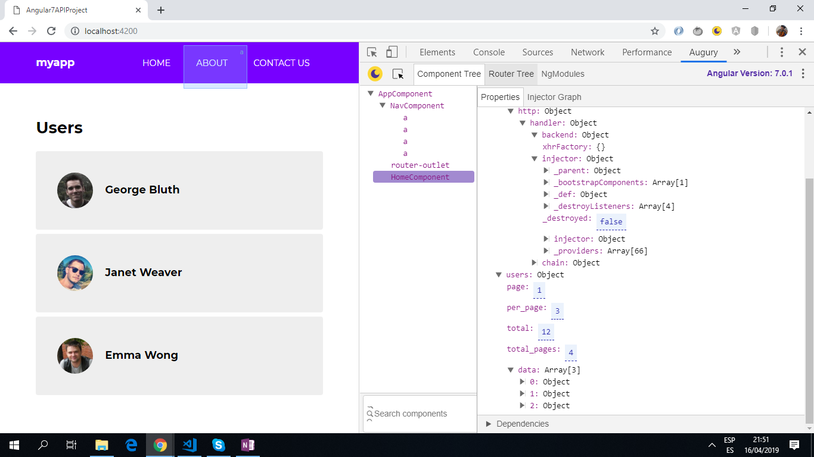
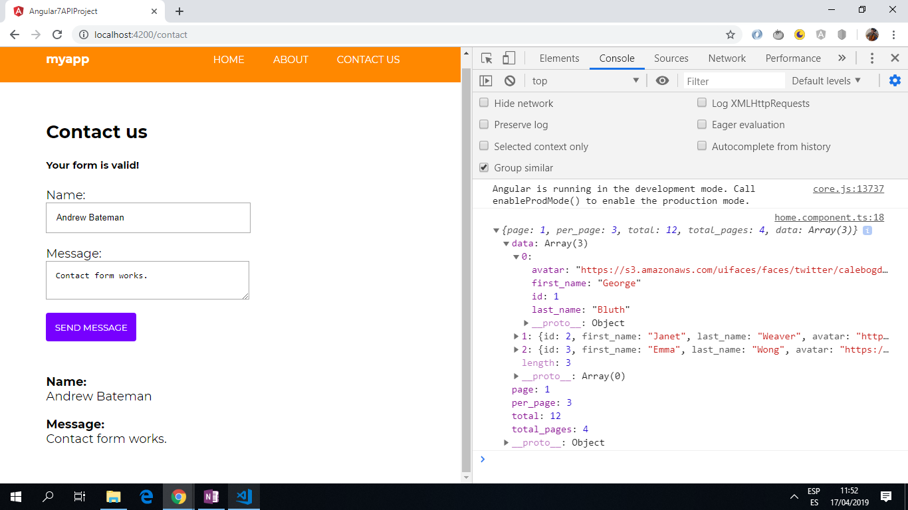

# Angular API Project

* App using a DataService with httpClient to get json data from an external API.
* App also submits a simple Contact form.
* **Note:** to open web links in a new window use: _ctrl+click on link_


## Table of contents

* [Angular API Project](#angular-api-project)
  * [Table of contents](#table-of-contents)
  * [General info](#general-info)
  * [Screenshots](#screenshots)
  * [Technologies](#technologies)
  * [Setup](#setup)
  * [Code Examples](#code-examples)
  * [Features](#features)
  * [Status & To-Do List](#status--to-do-list)
  * [Inspiration](#inspiration)
  * [Contact](#contact)

## General info

* Routing module allows user to navigate between Home, About and Contact pages.
* API json/image data displayed: firstname, lastname and avatar.
* Angular FormBuilder used to allow user to submit a form with name and message. Form uses validation.
* Simple app.

## Screenshots

.
.

## Technologies

* [Angular v12](https://angular.io/)
* [RxJS Library v6](https://angular.io/guide/rx-library) used to [subscribe](http://reactivex.io/documentation/operators/subscribe.html) to the API data [observable](http://reactivex.io/documentation/observable.html).
* [The HttpClient in @angular/common/http](https://angular.io/guide/http) offers a simplified client HTTP API for Angular applications that rests on the XMLHttpRequest interface exposed by browsers.

## Setup

* Run `npm i` to install dependencies
* Run `ng serve` for a dev server. Navigate to `http://localhost:4200/`. The app will automatically reload if you change any of the source files.

## Code Examples

* `home.component.ts`

```typescript
import { Component, OnInit } from "@angular/core";
import { DataService } from "../data.service";

@Component({
  selector: "app-home",
  templateUrl: "./home.component.html",
  styleUrls: ["./home.component.scss"]
})
export class HomeComponent implements OnInit {
  users: Object;

  constructor(private data: DataService) {}

  // on init the Dataservice getUsers() function supplies a user array object.
  ngOnInit() {
    this.data.getUsers().subscribe(data => {
      this.users = data;
      console.log(this.users);
    });
  }
}
```

* `data.service.ts`

```typescript
import { Injectable } from "@angular/core";
import { HttpClient } from "@angular/common/http";

@Injectable({
  providedIn: "root"
})
export class DataService {
  constructor(private http: HttpClient) {}

  getUsers() {
    return this.http.get("https://reqres.in/api/users");
  }
}
```

## Features

* API web link could be changed to get different and more complex data.

## Status & To-Do List

* Status: Working. Updated may 2021.
* To-Do: Nothing.

## Inspiration

* [Gary Simon of Coursetro Tutorial: Angular 7 Tutorial - Learn Angular 7 by Example](https://coursetro.com/posts/code/171/Angular-7-Tutorial---Learn-Angular-7-by-Example)

## :file_folder: License

* This project is licensed under the terms of the MIT license.

## :envelope: Contact

* Repo created by [ABateman](https://github.com/AndrewJBateman), email: gomezbateman@yahoo.com
